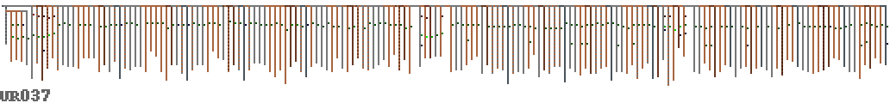

# Coding with Knots

The Inca empire flourished at it's height to 37 million people, without
the need of money or a written language. We know that numeric
information was stored by the Incas using Quipu, a digital knot based
recording system which was used in combination with black and white
stones to read and calculate[]. Not many of them are extant, most were burned in the colonial wars. Until today, two thirds of the quipus discovered are
untranslated, and do not fit into the known numeric coding system.


A Spanish illustration of a Khipukamayuq (knot maker/keeper)


A close up of a small quipu showing undecyphered changes in colour, material and twist.

As a civilisation coming to terms with transitions to digital forms of
social organisation, the Incas provide us with a useful counterpoint
with which to understand our relationships with technology.

Much of the data contained within the Inca's knots are still completely unknown
to archaeological research, and there may be value in bringing a
cross-disciplinary approach, applying different visualisation and
sonification methods to this problem. These methods, becoming attuned to what we try to convey with them, in turn may change the way we approach contemporary data.

The information available to us via the database of the Harvard Quipu Archive[http://khipukamayuq.fas.harvard.edu/] is derived from a set of Quipus encoded with information on thread type, knot type and position, colour and the currently understood base 10 numeric encodings.

## Methods

How to approach something of which we only know that it represents something we don't know? Even more, where we don't know in what way it is represented? From reports we learn that quipus were reformulated in use – they were a dynamic medium, more like a chalkboard than a book; they were used to archive, to convey, and operate on information. Resembling scripture, we still cannot take it as a given that they were read from left to right only.

The problem resembles that of the archeological reconstruction of *chaînes opératoires*: the ramified paths of actions that were performed in the production of paleolithic stone tools, paths which sometimes can be read out of the artefacts and the left-overs and traces of this process [Peter Bleed. Trees or Chains, Links or Branches: Conceptual Alternatives for Consideration of Stone Tool Production and Other Sequential Activities, Journal of Archaeological Method and Theory 8 (2001), no. 1, 101–127]. Only that here, the resulting artefact, rather than merely a result, is meant to actively convey and compute information. Where the translation and computation practice is unknown, however, progress is difficult.

For the time being, perhaps the best we can do is to superpose the left-overs of past methods with our own translational and computational practices, and hope for a heuristic widening of the horizon. In the following we briefly address one particular way of such a heuristic: in *modality* (image and sound) on the one hand, and in *temporality* (reading methods), on the other.

## Visualisation

To get a first understanding of the types of
structures present in Quipu, a simple parser for the data was
constructed[] which then converted the data into a form readable by
the common command line application Graphviz[]. This convenient way to automatically layout tree structures provided us with a schematic representation of the
structure of the record, with knots and colours.


UR1138 rendered using Graphviz

The quipu cord colours are encoded in the database using Ascher colour
codes
[Ascher, Marcia; Robert Ascher (1978). Code of the Quipu: Databook. Ann Arbor: University of Michigan Press. ASIN B0006X3SV4.]
which is an adapated form of ISCC-NBS colour coding, a standard from the
1939
[D. B. Judd and Kenneth L. Kelly (1939). “Method of designating colors and a dictionary”. Journal of Research of the National Bureau of Standards 23, p 355. RP1239.]
this was converted to hex RGB values required for the visualisation
using this website[http://tx4.us/nbs-iscc.htm].

# PixelQuipu

The Graphviz visualisations are quite limited, as they tend
to result in very large images, and don't provide enough control over how they
are drawn. Also, topologically oriented displays are naturally limited where metrics are at stake. We needed to get more of an overview of the data, displaying
the knots in the right positions with the pendants being the right
length. A new 'pixelquipu' system[] was written to display a Quipu
directly from the Harvard dataset:


The knots are shown as a single pixel attached to the pendant, with a
colour code of red as single knot, green for a long knot and blue as a
figure of eight knot (yellow is unknown or missing). We are interested
in the overall data rather than the specific values so the value of the
knot sets the brightness of the pixel. The colour variations for the
pendants are represented, but there is no difference between twisted and
alternating colours, also no twist direction is visualised.

Such a representation makes it easier to compare whole quipus, to compare their parts, to find reoccurring details and to shift focus from global to local structure.


We can now look at some quipus in more detail – what was the purpose of
the red and grey striped pendants in the quipu below? They contain no
knots, are they markers of some kind? This also seems to be a quipu
where the knots do not follow the decimal coding pattern that we
understand, they are mostly long knots of various values.


There also seems to be data stored in different kinds of structure in
the same quipu – the collection of sub-pendants below in the left side
presumably group data in a more hierarchical manner than the right side,
which seems much more linear – and also a colour change emphasises this.


Read left to right, this long quipu below seems very much like you’d
expect binary data to look – some kind of header information or
preamble, followed by a repeating structure with local variation. The
twelve groups of eight grey pendants seem redundant – were these meant
to be filled in later? Did they represent something important without
containing any knots?


The original idea of the pixelquipu was the attempt to fit all the
quipus on a single page for viewing, as it represents them with the
absolute minimum pixels required. So finally, here are both pendant colour and
entropy shown for all 247 quipu we have the data for:


# Entropy

As we have so little idea what the Inca are telling us (or rather each other) in their Quipu,
it seems appropriate to add a basic cryptanalysis approach to our toolkit of
inquiry. One of the first things that a cryptanalyst will do when
inspecting an unknown system is to visualise its entropy in order to
get a handle on structures or patterns in the underlying
information. The concepts of entropy differ very much in the different
theories. Here, for simplicity, we use entropy as [shannon and weaver] defined it:
a measure of the *minimum* possible "knowledge" implied by some amount of data. Entropy thereby describes how representation is bounded by specific laws of physics.

Here are all the quipu in the Harvard database in order of average
 entropy bits they represent (only listing every other quipu ID):


This graph is calculated by making lists of all the discrete data of the
same type, e.g. knot value, type, tying direction, pendant colours and
ply direction (ignoring lengths and knot positions as these are
continuous) – then calculating Shannon entropy on histograms for each
one and adding them together.

We can also compare different types of information against one another,
for example the main data we currently understand has some specific
meaning are the knot values, partly derived from the knot type (long,
single or figure of eight), which represent a decimal notation. If we
compare the entropy of these we can expect them to have roughly similar
average amounts of information:


The meanings of colours, ply and structure are largely unknown, but we
can compare them with the knot values which we do understand. This
could give an indication if they contain information. Here are the knot
values compared with the colours:


And this is pendant ply direction compared with knot values for each
quipu:


From this work we could see that the relationship to various data types
is fairly uniform, and is not clustered in any way which would indicate
different modes or categories of quipu. We can also use this technique
to located outliers to inspect further.

As well as looking at a quipu as a discrete unit, we can also look
inside them and view their structure in terms of relative entropy. This
is done below hierarchically, so a pendant’s entropy (shown as
brightness) is that of its data plus all the sub-pendants, which seemed
most appropriate given the non-linear form that the data takes.




This figure shows the local entropy for all the Quipu.


# Sonification
## On the method

Where the significance of the structure of a specific medium is unknown,
sonification can be a way to gain new insight. There are various reasons
for this, which have partly to do with the way understanding is coupled
with perception. Partly it is also due to the fact that listening takes
a specific time and this is time we spend with absorbing a texture and its
potential internal connections.

Visualisation offers the advantage of a very differentiated spatial distribution. By contrast, sonification is an excessively temporal method, which means that it can not only animate relationships, as one would do with a moving image, but everything is conveyed through oscillation.

But there are very many different sonification approaches in a
sonification laboratory [Till Bovermann, Julian Rohrhuber, and Alberto de Campo, Laboratory Methods for Experimental Sonification, The Sonification Handbook, Logos Publishing House, Berlin, 2011] – which one to choose if we want to better understand quipus?


Our case presents specific
challenges, because quipus are a branching structure, which, instead of just being laid out in space, has to be distributed in a time series.
This obstacle has the positive effect that it broaches the tacit assumptions that remain hidden in pictorial representation: in fact we do not know how the quipus were read, so that the  correct reading order is uncertain, and out of the many possible paths, many are non-trivial. Moreover, even reading orders that were not used by the quipu-makers may reveal important facts about what they encode.

The material qualities of quipus present us with the challenge of taking many levels of structured properties into account, including colours, knot positions, knot types, and ply. In our first experiments, we used sonification to juxtapose them in time.

Our experiments used the computer language SuperCollider, which in its abstraction level is optimal for the task at hand. Most of the program text can be changed at runtime, so that no graphical user interface precludes ideas of the researchers. The language is relatively well documented, and can be easily extended toward specific needs. A typical program in our system looks as follows:

```
// inka telefax
(
Tdef(\x, {
	~traverse.(~data, { |x|
		var note = x[\colours] / 255 * 32;
		if(note.notEmpty, {
			(instrument: \sin, note: note, sustain: 0.1).play;
		});
		0.1.wait;
	})
}).play
)
```

In the following, we explain the motivations and outcomes of such scripts starting from a single dimension (here the sonification of thread colour) and the concurrent display of multiple dimensions.

## Sonification experiments
### Thread colour: a single dimension display

Quipus have a very distinct shape: a rather long series of small graphs, each
of which has a couple of potentially relevant, but very different
dimensions (such as color, number, length). Because sonification can give good insight into parallel serial data, our first
sketch was to treat the series of pendants from one end of the primary
cord to the next, as a series in time (as you would do with a text).

The current state of research makes it plausible that the colours used
in quipus are of significance, but it is so far unclear of what. The
shades of colours are subtle, as is their possible meaning. To start
with, we sonified the colour pattern of the quipu UR004 in a very simple
way: a series of very short sine tone chords represent the red, green
and blue components. The different colours of each pendant were thereby read like a musical chord:


This causes tones of grey to sound like a single tone, and the
difference between components stands out as distance between separate
partials. A rather simplistic sketch as it is, it nevertheless revealed
a surprisingly rich rhythmic structure, which would be easy to overlook
visually. This gave us some confidence that we should pursue this
direction a little further.

### Superposition: a multidimensional display

After an inquiry in the interpretations of archaeological findings,
we found two promising quipus which made us curious. The paper by
Juliana Martins[] on the astronomical analysis of an Inca Quipu pointed
to two interesting candidates from Leymebamba (UR006 and UR009).

This time, we sonically displayed more of the data dimensions. Here is a first result (UR006):


It is not well visible in the spectrogram but audible that each short sound event (about 1/10 of a second an shorter as we go down the subsidiaries) has a number of independent timbral properties, some of which have significant pattern across longer sections. Here is an overview of what “quipu
dimension” is mapped onto which sound dimension:

| quipu | sound |
| --- | --- |
| colour 	| sine tone spectrum of three partials |
| branching level |	duration between sound grains (inter onset duration) |
| pendant length |	duration of each sound grain (relative to inter onset time) |
| pendant attach (verso or recto) |	pan position left or right channel |
| pendant ply (S or Z) |	envelope shape (audible as “inversion effect”) |
| unknown values |	are usually interpreted as neutral (pan) or low (colour) |

The moments of audible acceleration result from areas with many pendants
that have subsidiaries (side branches). In various dimensions rhythmic
patterns appear, which partly coincide and partly remain
independent. Also, in some moments, we can hear sudden changes of the
overall pattern, indicating a transition into a different logic.

You can see how the multidimensional display is a relatively straightforward extension of the single dimension one.
```
(
Tdef(\x, {
	var pani = ('R':-1, 'V':1, 'U':0);
	var plyi = ('S': 0, 'Z': 1, 'U': 0.5);
	~traverse.(~data, { |x, level|
		var colours = x[\colours], note, pan, len, ply;
		var dur = 1/2 ** (level - 1) / 10;
		if(colours.notEmpty, {
			pan = pani[x[\pendant_attach]];
			ply = plyi[x[\pendant_ply]];
			len = x[\pendant_length] ? 25 / 25;
			note = x[\colours] / 255 * 36 + 12;
			(
				note: note,
				dur: dur,
				instrument: \sin,
				amp: 0.1/3,
				pan: pan,
				legato:len * 1.5,
				ply: ply
			).play;
		});
		dur.wait;
	})
}).play
)
```


# Conclusions

Weaving in the broadest sense of the term covers an intermediate space between what has been called "form and function". Form usually being that of non-functional representation or decoration, function usually that of non-formal use for specific practical purposes. These terms are misplaced, as it is commonly acknowledged, because decorative and iconic detail at least has a social function. [see also Textile Semantics: Considering a Communication-based Reading of Textiles] Quipus are a specific case, however, because here, the decorative detail serves a representative function, mostly, but perhaps not exclusively, an administrative one. Because of the small number of extant artefacts, their retrospective decoding becomes a difficult task; at the same time, all measurable information about them has been translated to the predominant administrative tool of our culture, excel sheets.

By proposing some experimental "laboratory methods" [ref] for the sonification of those data sets, we hope to have broadened the perspective of their reading. Thereby already a simple entropy analysis and the concise visualisation provided overviews of both the relationship between quipu across the corpus as well as structural changes contained within them.

Listening to the inner structure of these artefacts is a method of systematic spreading of awareness over time. Unlike an image which can be read in any order, a sonification aligns the reading direction, while keeping undecided what is being listened to. Sound thereby has very different affordances than the common descriptive, diagrammatic and numerical methods. Used by artists and composers, such sonifications can cultivate a movement between archeological interest and aesthetic sensibility. Used by archeologists as a methodological alternative, it might lead to new ideas of how to read quipus in their cultural context.
