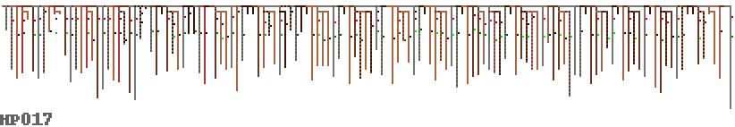

# Coding with Knots

The Inca empire flourished to up to 37 million people, without the need
of money or a written language. We know that numeric information was
stored using Khipu, a digital knot based recording system which was used
in combination with black and white stones to read and calculate. Two
thirds of the quipus disovered are un-translated, and do not fit into the
known numeric coding system – what information do they hold?

A Spanish illustration of a Khipukamayuq (knot maker/keeper)
 

A close up of a small quipu showing undecyphered changes in colour, material and twist.

As a civilisation coming to terms with transitions to digital forms of
social organisation, the Incas can provide us with a useful counterpoint
with which to understand our relationships with technology.

Much of the data contained within the Inca's knots are still a mystery
to archaeological research, and there may be value in bringing a
cross-disciplinary approach to the problem as artists, musicians and
programmers working with thread.

The data available to us via the Harvard Quipu Archive[] is a set of
Quipus encoded with information on thread type, knot type and position,
colour and the currently understood base 10 numeric data.

## Visualisation

To start with we needed to get a quick understanding of the types of
structures present in Quipu, so a simple parser for the data was
constructed[] which then converted the data into a form readable by
Graphviz[]. This provided us with schematic representation of the
structure, knots and colours.

The quipu cord colours are encoded in the database using Ascher colour
codes
[Ascher, Marcia; Robert Ascher (1978). Code of the Quipu: Databook. Ann Arbor: University of Michigan Press. ASIN B0006X3SV4.]
which is an adapated form of ISCC-NBS colour coding, a standard from the
1939
[D. B. Judd and Kenneth L. Kelly (1939). “Method of designating colors and a dictionary”. Journal of Research of the National Bureau of Standards 23, p 355. RP1239.]
this was converted to hex RGB values required for the visualisation
using this website[http://tx4.us/nbs-iscc.htm].

# PixelQuipu

The Graphviz visualisations have quite a few limitations, as they tend
to make very large images, and there is limited control over how they
are drawn. We needed to get more of an overview of the data, displaying
the knots in the right positions with the pendants being the right
length. A new system was written to display a Quipu directly from the Harvard dataset:

The knots are shown as a single pixel attached to the pendant, with a
colour code of red as single knot, green for a long knot and blue as a
figure of eight knot (yellow is unknown or missing). We are interested
in the overall data rather than the specific values so the value of the
knot sets the brightness of the pixel. The colour variations for the
pendants are reresented, but there is no difference between twisted and
alternating colours, also no twist direction is visualised.

Another advantage of this form of rendering is that we can draw data
entropy within the quipu in order to provide a different view of how the
data is structured, as a attempt to uncover hidden complexity. This is
done hierarchically so a pendant’s entropy is that of its data plus all
the sub-pendants, which seemed most appropriate given the non-linear
form that the data takes.

We can now look at some quipus in more detail – what was the purpose of
the red and grey striped pendants in the quipu below? They contain no
knots, are they markers of some kind? This also seems to be a quipu
where the knots do not follow the decimal coding pattern that we
understand, they are mostly long knots of various values.

There also seems to be data stored in different kinds of structure in
the same quipu – the collection of sub-pendants below in the left side
presumably group data in a more hierarchical manner than the right side,
which seems much more linear – and also a colour change emphasises this.

Read left to right, this long quipu below seems very much like you’d
expect binary data to look – some kind of header information or
preamble, followed by a repeating structure with local variation. The
twelve groups of eight grey pendants seem redundant – were these meant
to be filled in later? Did they represent something important without
containing any knots? We will probably never know.

The original thinking of the pixelquipu was to attempt to fit all the
quipus on a single page for viewing, as it represents them with the
absolute minimum pixels required. Here are both pendant colour and
entropy shown for all 247 quipu we have the data for:

# Entropy

As we have so little idea what the Inca are telling us in their Quipu,
it seems appropriate to add a cryptanalysis approach to our toolkit of
inquiry. One of the first things that a cryptanalyst will do when
inspecting an unknown system is to visualise it’s entropy in order to
get a handle on any structures or patterns in the underlying
information. This concept comes from Claude Shannon’s work on
information theory in the 40’s, where he proved that information obeys
fundamental laws of physics. The concept that information and
“cyberspace” may not be as intangible and otherworldly as we might
believe (in fact is grounded in physical reality along with everything
else) is one of the recurring themes of the weavingcodes project.

Shannon’s innovation was to separate the concepts of data quantity from
information value, and he claims that information is equivalent to
surprise – the more surprising a piece of data is, the more information
it contains. Conversely a piece of information which we expect to hear
by definition doesn’t really tell us very much. The potential for some
data to be surprising (or more specifically it’s potential to reduce our
uncertainty) can be measured statistically, with a quantity he called
entropy, as it is analogous to states in thermodynamic systems.

Shannon defined a generalised communication system, which is handy to
give us a way of reasoning about our situation in relation to the
Inca. Our main unknown is the source of the messages they are sending
us, are they accounting information, calendars or stories? We know a bit
more about the transmitters of the messages, the khipukamayuq – the knot
makers and quipu keepers. At the time Shannon was working on information
theory, he was part of the start of the movement away from analogue,
continuous signals and towards digital signals – with advantages that
they are highly resistant to noise and can be carried further and
combined together to increase bandwidth. Quipu are also mainly comprised
of digital information – the type of a knot, the number of turns it’s
comprised of or the twist direction of a thread are all discreet (either
one thing or another) and therefore highly robust to material decay or
decomposition. We can still ‘read’ them confidently after 500 years or
more without the digital signal they represent being degraded too badly,
if only we could understand it. At the same time, none of us working on
this have access to a real quipu, so our receivers are the
archaeologists and historians who study them, and compile archives such
as the Harvard Quipu Archive we are using.

Although entropy is a very simplistic approach mathematically, it’s main
use is to give us a tool for measuring the comparative information
carrying potential of data which we have no idea about. Here are all the
quipu in the Harvard database in order of average entropy bits they
contain (only listing every other quipu ID):

This graph is calculated by making lists of all the discreet data of the
same type, e.g. knot value, type, tying direction, pendant colours and
ply direction (ignoring lengths and knot positions as these are
continuous) – then calculating Shannon entropy on histograms for each
one and adding them together.

We can also compare different types of information against one another,
for example the main data we currently understand has some specific
meaning are the knot values, partly derived from the knot type (long,
single or figure of eight), which represent a decimal notation. If we
compare the entropy of these we can expect them to have roughly similar
average amounts of information:

The meanings of colours, ply and structure are largely unknown. Here are
the knot values compared with the colours:

And this is pendant ply direction compared with knot values for each
quipu:

At this point the most useful aspect of this work is to give us some
outliers to inspect visually and sonically – more on that soon.

# Sonification

To start with Dave briefly introduced the Inca civilisation, some of
their scientific achievements and very different understanding of time
and how much of this culture remains in current societies in the
region. We looked at the context in which we think quipus were used, as
the basis of organisation (with threads) of a large empire with no money
or other forms of written record. Moving on to our tools we explored
graphviz, and experimented a little with improving the visualisation
then moving in to the world of supercollider we explored the data
provided by the dot files.

It turned out to be too limiting to interpret only the graph drawing
instructions in supercollider, so we found we could include more
complete information as ‘hidden data’ (twist, length of the pendants or
type, value and spin of the knots). These extra data elements could be
added in such a way as to make them silently ignored by graphviz for
visualisation. This saved a lot of time needing to come up with another
intermediate format.

We also needed some overview of the entire database, in order to search
for interesting quipu to sonify. Various quipus have been partially
understood, for example some possibly contain data structures for
calendar information based on solar and lunar time. Others contain
accounting data, with matching hierarchical records found in other
quipus. The most mysterious are so called ‘narrative quipus’ which don’t
seem to fit the decimal system at all, meaning the knots don’t line up
neatly in rows for reading in term of units, tens, hundreds and
thousands.

When the significance of the structure of a specific medium is unknown,
sonification can be a way to gain new insight. There are various reasons
for this, which have partly to do with the way understanding is coupled
with perception, partly also simply with the fact that listening takes
time and this is time we spend with absorbing a texture and its
potential internal connections.

But there are very many different sonification approaches in a
sonification laboratory – which one to choose? In the seminar we
discussed for a while the general problem, namely how to understand
graphs as time series, which is not always easy: many different
non-trivial paths are possible. The quipus have a very distinct shape: a
rather long series of small graphs, each of which have a couple of
potentially relevant, but very different dimensions (such as color,
number, length). Because sonification is particularly good at giving
insight into parallel serial data, our first sketch was to treat the
series of pendants from one end of the primary cord to the other, as a
series in time (as you would do with a text).

The current state of research makes it plausible that the colours used
in quipus are of significance, but it is so far unclear of what. The
shades of colours are subtle, as is their possible meaning. To start
with, we sonified the colour pattern of the quipu UR004 in a very simple
way: a series of very short sine tone chords represent the red, green
and blue components:

This causes tones of grey to sound like a single tone, and the
difference between components stands out as distance between separate
partials. A rather simplistic sketch as it is, it nevertheless revealed
a surprisingly rich rhythmic structure, which would be easy to overlook
visually. This gave us some confidence that we should pursue this
direction a little further.

The next day we began by going back to the data formats, and Dave
included a number of data dimensions to the graphviz files. Especially
interesting were arrays of colours, which represent alternating coloured
threads, and some binary opposed properties, like ply and knot
orientation. Some more reading about the interpretations of
archaeological findings, we found two promising quipus which made us
curious. The paper by Juliana Martins on the astronomical analysis of an
Inca Quipu pointed to two interesting candidates from Leymebamba (UR006
and UR009), which we began to work on in the afternoon.

Here is a first result (UR006):

You can hear in this example that each short sound event (about 1/10 of
a second an shorter as we go down the subsidiaries) has a number of
independent timbral properties. Here is an overview of what “quipu
dimension” is mapped onto which sound dimension:

colour 	sine tone spectrum of three partials
branching level 	duration between sound grains (inter onset duration)
colour 	sine tone spectrum composed of three partials
pendant length 	duration of each sound grain (relative to inter onset time)
pendant attach (verso or recto) 	pan position left or right channel
pendant ply (S or Z) 	envelope shape (audible as “inversion effect”)
unknown values 	are usually interpreted as neutral (pan) or low (colour)

The moments of audible acceleration result from areas with many pendants
that have subsidiaries (side branches). In various dimensions rhythmic
patterns appear, which partly coincide and partly remain
independent. Also, in some moments, we can hear sudden changes of the
overall pattern, indicating a transition into a different logic.

